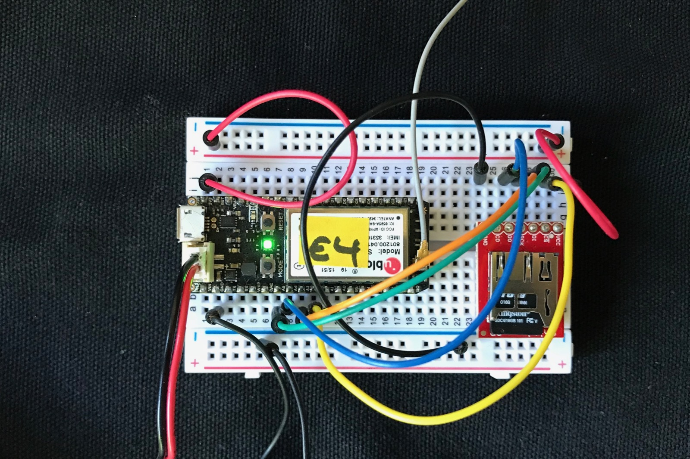
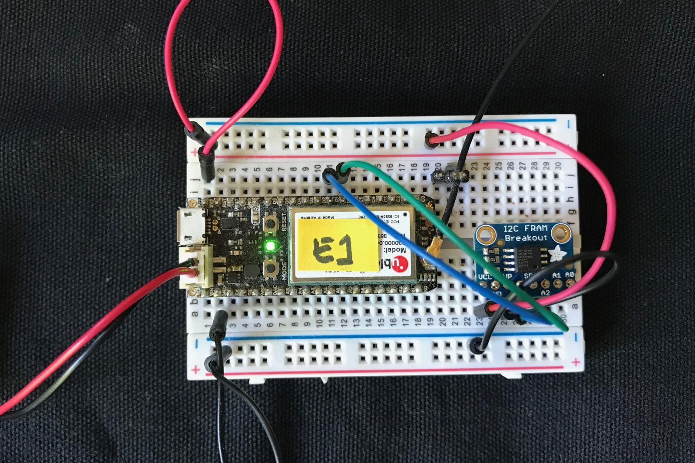

# Device Key Helper

**Warning: This is an early development version of this code and there could still be bugs.**

- Location: https://github.com/rickkas7/DeviceKeyHelperRK
- License: MIT (Free for use in open-source and closed-source projects, including commercial products.)

## Background

### About public key cryptography

Particle devices like the Photon and Electron authenticate with the Particle cloud using public key cryptography. Each side has a public key and a private key. The device private key is only stored on the device but the public key can be shared even over insecure channels. You can share it with everyone, even. The Particle cloud knows every device's public key.

For the cloud side, the cloud private key is kept secret, but all devices know the cloud public key. It's publicly available on a web site and in the Particle CLI source. The cloud public key is not a secret.

When a device handshakes, it encrypts some data using the device private key and the cloud public key. The cloud is able to decrypt this because it knows the cloud private key and the device public key (the opposite side). It then sends data back to the device encrypted with the cloud private key and the device public key.

That data can only be decrypted by the device because decrypting it requires the cloud public key and the device private key, and only the device knows the device private key. 

This process assures that the cloud is who it says it is, not a rogue cloud, because only the real cloud knows its private key. And the cloud knows the device is authentic, because only the device knows its private key.

And a third-party snooping on the process can't gain anything because the private keys never leave the respective sides. A man-in-the-middle can't hijack or spoof either side because he wouldn't know the private keys.

This process requires a lot of computation, and is only used to authenticate both sides and set up a session key to encrypt the data for the connection using fast symmetric encryption like AES.

### The device key problem

The private device key is stored in the configuration flash on the device, and only there. But what happens if the flash is erased or corrupted?

In that case the device will generate a new private and public device key. They have to be generated in pairs because they're cryptographically connected, each private key has a specific public key that's able to decrypt its data.

When the device goes to connect with the cloud using its new device keys, however, there's a problem: the public key stored on the cloud doesn't match the current public key, and it can't decrypt the data. It assumes that some rogue device is trying to impersonate a different device and shuts down the connection.

### particle keys doctor

If you've experienced this, you probably know that you fix this in DFU mode (blinking yellow) by using using:

```
particle keys doctor YOUR_DEVICE_ID
```

What this does is upload your new device public key to the cloud, so they match again.

### Why can't the device just do it itself?

There are two reasons:

- The keys upload uses TLS/SSL encryption to the Particle API and the Photon and Electron don't support that very well.
- When you use the Particle CLI, you need to be logged into the account that has claimed the device.

The latter is the real problem. Quite intentionally, devices don't contain login credentials (password or access token) for the account that it is claimed to. If it did, you'd be able to steal a device and take over the account, and that would be bad. So there are no access tokens stored on the device, so there is no way to authenticate a change of key from the device itself.

### The cloud public key

The cloud public key can also be erased. This is fixed using:

```
particle keys server
```

System firmware 0.7.0 and later can repair the cloud public key by itself, because that's not a secret and it's the same for every device class. (Photons and Electrons have different cloud public keys, but every Photon has the same cloud public key.)


## Key recovery to the rescue

What if, instead of generating a new, incompatible device private key, you just restored the old one? That's what this library does.

### Why doesn't the device just do that itself?

The device private key is kind of large and specific to each device. While there's a demo of storing it in the emulated EEPROM, that's not the best location as the ideal location is not in the STM32 flash. Also, it takes over a good chunk of the EEPROM, especially on the Photon and P1.

Ideally, this requires an external flash (SD card or SPI flash) or something like a FRAM. Since that's not standard equipment, it's not practical to include this in system firmware.

### How the library works

You instantiate an object, usually as a global variable, that specifies the storage medium and other parameters specific to that medium.

For example, for EEPROM, the offset to store at:

```
// Save and restore the device keys in EEPROM at offset 100 in the EEPROM
DeviceKeyHelperEEPROM keyHelper(100);
```

Or for SdFat, the filename to store in:

```
DeviceKeyHelperSdFat deviceKeyHelper("keys");
```

Then in setup() you start monitoring:

```
deviceKeyHelper.startMonitor();
```

You also must do one or both of these things:

- Use SYSTEM\_MODE(SEMI\_AUTOMATIC) or SYSTEM\_MODE(MANUAL)
- Use SYSTEM\_THREAD(ENABLED)

The reason is that in AUTOMATIC with threading disabled, setup() is not run until successfully connected to the cloud so the connection monitor won't be started and the keys recovery will never work.

When you successfully connect to the cloud, if the key has been changed the new value will be saved in your storage medium. If you manually do a particle keys doctor, the new key will be automatically saved.

If you are using 0.8.0 or later, and a keys error occurs, the key will be restored and the device reset.

If you are using an earlier system firmware version, after three failed connections in a row, the key will be restored and the device reset. This is because there's no way to get the connection error prior to 0.8.0.

A minimum system firmware version of 0.6.1 is required as the cloud connection system events are used internally.

### Simple Example

The simple example in 1-simple-DeviceKeyHelperRK.cpp stores in EEPROM at a given location:

```
#include "Particle.h"

#include "DeviceKeyHelperRK.h"

SYSTEM_MODE(SEMI_AUTOMATIC);

SerialLogHandler logHandler;

// Save and restore the device keys in EEPROM at offset 100 in the EEPROM
DeviceKeyHelperEEPROM deviceKeyHelper(100);

void setup() {

	// You must call this from setup to start monitoring for keys errors
	deviceKeyHelper.startMonitor();

	// You either need to use SYSTEM_THREAD(ENABLED) or SYSTEM_MODE(SEMI_AUTOMATIC) because
	// in thread disabled AUTOMATIC mode, setup() isn't called until cloud connected and the
	// code to monitor the connection would never be started via startMonitor().
	Particle.connect();
}

void loop() {

}

```

The only real code is allocation of the deviceKeyHelper object:

```
DeviceKeyHelperEEPROM deviceKeyHelper(100);
```

This uses the built-in EEPROM emulation and saves and restores the keys to offset 100. 

The size of the data depends on the type of device:

- For Wi-Fi devices (Photon, P1): 1608 bytes
- For cellular devices (Electron, E series): 328 bytes

And you need to start the monitor from setup();

```
	deviceKeyHelper.startMonitor();
```


### SpiffsParticleRK

The remaining examples are not in the examples directory because they depend on another library. To build, you can use Particle Dev (Atom IDE) or the Particle CLI to build the source in the more-examples directory. For example:

```
cd more-examples/1-SpiffsParticle-DeviceKeyHelperRK
particle compile electron . --saveTo firmware.bin
```

The [SpiffsParticleRK](https://github.com/rickkas7/SpiffsParticleRK) library supports SPI-connected NOR flash chips. These are typically tiny 8-SOIC surface mount chips, intended to be included on your own circuit board. There are also breadboard adapters that are available, shown in the examples below.

The chips are really inexpensive, less than US$0.50 in single quantities for a 1 Mbyte flash. They're available in sizes up to 16 Mbyte.

SPI flash is less expensive than SD cards, and do not need an adapter or card slot. Of course they're not removable.

The underlying [SpiFlashRK library](https://github.com/rickkas7/SpiFlashRK) library supports SPI NOR flash from

- ISSI, such as a [IS25LQ080B](http://www.digikey.com/product-detail/en/issi-integrated-silicon-solution-inc/IS25LQ080B-JNLE/706-1331-ND/5189766).
- Winbond, such as a [W25Q32](https://www.digikey.com/product-detail/en/winbond-electronics/W25Q32JVSSIQ/W25Q32JVSSIQ-ND/5803981).
- Macronix, such as the [MX25L8006EM1I-12G](https://www.digikey.com/product-detail/en/macronix/MX25L8006EM1I-12G/1092-1117-ND/2744800)
- The external 1 Mbyte flash on the P1 module.
- Probably others.

Using it just requires selecting the correct SPI flash chip and the filename to store the keys in:

```
#include "Particle.h"

// Make sure you include SpiffsParticleRK.h before DeviceKeyHelperRK.h, otherwise you won't have support for SpiffsParticle
#include "SpiffsParticleRK.h"

#include "DeviceKeyHelperRK.h"

SYSTEM_MODE(SEMI_AUTOMATIC);

// Set a reasonable logging level:
SerialLogHandler logHandler(LOG_LEVEL_WARN, { // Logging level for non-application messages
    { "app", LOG_LEVEL_INFO }, // Default logging level for all application messages
    { "app.spiffs", LOG_LEVEL_WARN } // Disable spiffs info and trace messages
});

// Chose a flash configuration:
// SpiFlashISSI spiFlash(SPI, A2); 		// ISSI flash on SPI (A pins)
// SpiFlashISSI spiFlash(SPI1, D5);		// ISSI flash on SPI1 (D pins)
SpiFlashMacronix spiFlash(SPI1, D5);	// Macronix flash on SPI1 (D pins), typical config for E series
// SpiFlashWinbond spiFlash(SPI, A2);	// Winbond flash on SPI (A pins)
// SpiFlashP1 spiFlash;					// P1 external flash inside the P1 module

// Create an object for the SPIFFS file system
SpiffsParticle fs(spiFlash);

DeviceKeyHelperSpiffsParticle deviceKeyHelper(fs, "keys");

void setup() {
	Serial.begin();

	// Initialize SPI flash with a volume size of 256K
	spiFlash.begin();
	fs.withPhysicalSize(256 * 1024);

	// Mount the SPIFFS file system
	s32_t res = fs.mountAndFormatIfNecessary();
	Log.info("mount res=%ld", res);

	if (res == SPIFFS_OK) {
		// If the file system was mounted, enable monitoring for keys errors
		deviceKeyHelper.startMonitor();
	}

	// You either need to use SYSTEM_THREAD(ENABLED) or SYSTEM_MODE(SEMI_AUTOMATIC) because
	// in thread disabled AUTOMATIC mode, setup() isn't called until cloud connected and the
	// code to monitor the connection would never be started via startMonitor().
	Particle.connect();
}

void loop() {
}
```

The code above has this SPI flash chip selected:

```
SpiFlashMacronix spiFlash(SPI1, D5);    
```

This configuration is for the [MX25L8006EM1I-12G](https://www.digikey.com/product-detail/en/macronix/MX25L8006EM1I-12G/1092-1117-ND/2744800), the 0.154", 3.90mm width 8-SOIC package, that fits on the unpopulated pads on the E series module.


Here's a Photon with a SPI flash breakout:


### P1 using SpiffsParticleRK

You can also use [SpiffsParticleRK](https://github.com/rickkas7/SpiffsParticleRK) with the P1 built-in flash.

See example: more-examples/1-SpiffsParticle-DeviceKeyHelperRK:

This is the same as the previous example, except you use this device:

```
SpiFlashP1 spiFlash;					// P1 external flash inside the P1 module
```


### P1 using flashee-eeprom

If you are already using [flashee-eeprom](https://github.com/m-mcgowan/spark-flashee-eeprom/) to store files in the P1 external flash, you can easily add support for saving keys in it as well:

See example: more-examples/4-flashee-eeeprom-DeviceKeyHelperRK:

```
	FRESULT fResult =  Flashee::Devices::createFATRegion(0, 4096*256, &fs);
	if (fResult == FR_OK) {
		// Start monitoring for connection failures
		deviceKeyHelper.startMonitor();
	}
	else {
		Log.info("failed to mount flashee file system %d", fResult);
	}

```


### SdFat

If you are using [SdFat](https://github.com/greiman/SdFat-Particle), see example more-examples/2-sdfat-DeviceKeyHelperRK:

```
#include "Particle.h"

// Make sure you include SdFat.h before DeviceKeyHelperRK.h, otherwise you won't have support for SdFat
#include "SdFat.h"

#include "DeviceKeyHelperRK.h"

SYSTEM_MODE(SEMI_AUTOMATIC);

// Pick a debug level from one of these two:
SerialLogHandler logHandler;
// SerialLogHandler logHandler(LOG_LEVEL_TRACE);

// Primary SPI with DMA
// SCK => A3, MISO => A4, MOSI => A5, SS => A2 (default)
SdFat sd;
const uint8_t chipSelect = A2;

// Secondary SPI with DMA
// SCK => D4, MISO => D3, MOSI => D2, SS => D1
// SdFat sd(1);
// const uint8_t chipSelect = D1;

DeviceKeyHelperSdFat deviceKeyHelper("keys");

void setup() {
	Serial.begin();

	if (sd.begin(chipSelect, SPI_HALF_SPEED)) {
		// If the file system was mounted, enable monitoring for keys errors
		deviceKeyHelper.startMonitor();
	}
	else {
		Log.info("failed to initialize SD card");
	}

	// You either need to use SYSTEM_THREAD(ENABLED) or SYSTEM_MODE(SEMI_AUTOMATIC) because
	// in thread disabled AUTOMATIC mode, setup() isn't called until cloud connected and the
	// code to monitor the connection would never be started via startMonitor().
	Particle.connect();
}

void loop() {
}
```



### MB85RC256V I2C FRAM

The MB85RC256V 32 Kbyte ferro-electric non-volatile FRAM is another place you can store your data.

See example: more-examples/3-fram-DeviceKeyHelperRK

```
#include "Particle.h"

// Make sure you include MB85RC256V-FRAM-RK.h before DeviceKeyHelperRK.h, otherwise you won't have support for MB85RC256V
#include "MB85RC256V-FRAM-RK.h"


#include "DeviceKeyHelperRK.h"

SYSTEM_MODE(SEMI_AUTOMATIC);

// Pick a debug level from one of these two:
SerialLogHandler logHandler;
// SerialLogHandler logHandler(LOG_LEVEL_TRACE);

// MB85RC256V FRAM on Wire (D0/D1) with default address (A0-A2 not connected, which have pull-downs
// on the Adafruit breakout board)
MB85RC256V fram(Wire, 0);

// Store the device keys starting at address 1000 in the FRAM
DeviceKeyHelperFRAM deviceKeyHelper(fram, 1000);


void setup() {
	Serial.begin();

	fram.begin();
	// fram.erase();

	// Start monitoring for connection failures
	deviceKeyHelper.startMonitor();

	// You either need to use SYSTEM_THREAD(ENABLED) or SYSTEM_MODE(SEMI_AUTOMATIC) because
	// in thread disabled AUTOMATIC mode, setup() isn't called until cloud connected and the
	// code to monitor the connection would never be started via startMonitor().
	Particle.connect();
}

void loop() {
}

```



The pins on the Adafruit breakout connect as typical for an I2C device:

- VCC to 3V3 (can also use VIN for a 5V I2C bus)
- GND to GND
- WP not connected (connect to VCC to prevent writes to the memory)
- SCL connect to D1 (SCL) (blue in the picture)
- SDA connect to D0 (SDA) (green in the picture)
- A2 not connected. Connect to VCC to change the I2C address. 
- A1 not connected. Connect to VCC to change the I2C address. 
- A0 not connected. Connect to VCC to change the I2C address. 

### Adding your own

You can add your own storage medium by subclassing DeviceKeyHelper or calling it directly with the appropriate parameters.

Take, for example, the implementation of the DeviceKeyHelperEEPROM:

```
class DeviceKeyHelperEEPROM : public DeviceKeyHelper {
public:
	/**
	 * @brief Store data in the onboard emulate EEPROM
	 *
	 * @param offset The offset to write to.
	 */
	inline DeviceKeyHelperEEPROM(size_t offset) :
		DeviceKeyHelper([offset](DeviceKeyHelperSavedData *savedData) {
			// Log.info("getting %u bytes at %u", sizeof(*savedData), offset);
			EEPROM.get(offset, *savedData);
			return true;
		},
		[offset](const DeviceKeyHelperSavedData *savedData) {
			// Log.info("saving %u bytes at %u", sizeof(*savedData), offset);
			EEPROM.put(offset, *savedData);
			return true;
		}) {
	};
};
```

Aside from the weird syntax caused by the C++ lambdas, all it does is create two lambda functions. The first has the prototype:

```
bool load(DeviceKeyHelperSavedData *savedData)
```

And the nearly identical save:

```
bool save(const DeviceKeyHelperSavedData *savedData)
```

The functions should return true on success or false on error, such as no saved data existing yet.

You don't have to use lambda functions, you can use plain C callbacks, but the lambda is particularly handy because of the capture. In the EEPROM example, it captures `[offset]` so the load and save functions have access to it.

The size of the data to save or load can be found by `sizeof(*savedData)` or `sizeof(DeviceKeyHelperSavedData)`.

When loading data, if the size you have saved is not the same as `sizeof(DeviceKeyHelperSavedData)` you should return false.